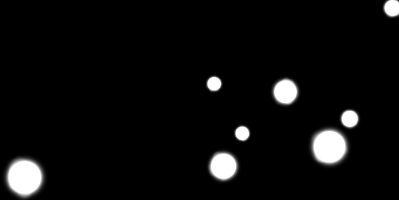

# SaveMeCircles  
  
  
  
This is a FREE game.  

[RELEASE DOWNLOAD](https://github.com/Dark-Gran/SMC/releases/tag/1.0)  
(use M to Mute sound)
  
If you'd like to give me feedback or see my other projects, [join us on Discord!](https://discord.gg/Hwetj9cWNn)

**Controls:**
- Game is played with Left Mouse Button / Touch only.
- Extra controls are:  
  - R to restart the current Level.
  - Left/Right Arrow to switch between Levels.
  - M to mute sound.
  
  
## About Project  
  
Free game based on a [previous prototype](https://github.com/Dark-Gran/SaveMeCircles).  

_"There are circles floating in space, and you can touch them to make them smaller and faster, or bigger and slower...  
You can also place a static circle of your own.  
Circles of same color merge, and the goal is to have no more than one circle from each color."_
  
To address performance issues of the prototype, Box2D engine (and LibGDX in consequence) has been replaced with Godot, as its "bodies" offer better support for the desired "non-newtonian" behaviour of objects (and therefore gameplay).  
  
Godot 3.x does not support simulating the world in the same extent as Box2D does, however such simulation has been deemed unnecessary as its only purpose was to "help with aim", which can also be done using raytracing (which is a _much_ more lightweight solution).  
Also, simulating the "future state of physics" constantly and in real-time (as was possible in the original prototype) goes against the original "chilled chaos" idea both visually and gameplay-wise.  
  
## Todo

_- fix collision bugs_  
